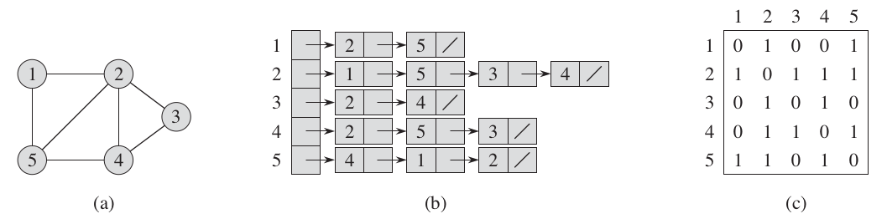
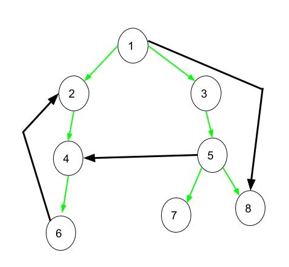

# About me

{height=75}

- Telecommunications, ESPA Alumni
- Computer Science, University of Reunion Island Alumni
- FaceDev Admin since 2012
- Founder member of AlgoMada
- Clojure dev
- Computer Science Enthusiast
- Current interests: Cryptocurrency, Clojure programming language
- Side project: BetaX Community {height=32} github.com/puchka

# Motivation: Why I do this?

{height=225}

# Definition of Computer Science

"We are about to study the idea of a computational
process. Computational processes are abstract beings that inhabit
computers. As they evolve, processes manipulate other abstract things
called data. The evolution of a process is directed by a pattern of
rules called a program. People create programs to direct processes. In
effect, we conjure the spirits of the computer with our spells."
Structure and Interpretation of Computer Programs, Harold Abelson and
Gerald J. Sussman

{height=100}

# Definition of Competitive Programming

‘Competitive Programming’ in summary, is this: “Given well-known
Computer Science (CS) problems, solve them as quickly as possible!”.

# Tips to be competitive

- Type Code Faster
- Quickly identify problem type
- Do Algorithm Analysis
- Master Programming Languages
- Master the Art of Testing Code
- Practice and More Practice

# Data Structures

Data structure is ‘a way to store and organize data’ in order to support efficient insertions, queries, searches, updates, and deletions.

# What is a graph?

A data structure to represent link between objects.
A graph is defined by a set of nodes V and a set of edges E.

We can summarize this definition by the following formula:

$$
G = (E, V)
$$

Example:
[https://www.redblobgames.com/pathfinding/grids/graphs.html#properties](https://www.redblobgames.com/pathfinding/grids/graphs.html#properties)

# What's the difference between a graph and a tree?

A graph can contain cycles (a node can be visited twice).

{height=200}

# Different type of graphs

- Acyclic Graph

A graph that has no cycle.

- Cyclic Graph

A graph that has at least one cycle.

{height=96}

# Different type of graphs

- Directed Graph 

A graph in which edge has direction. That is the nodes are ordered
pairs in the definition of every edge.

- Undirected Graph

A graph in which edge are not directed. Meaning, the edges are defined
by an unordered pair of nodes.

{height=96}

# Different type of graphs

- Directed Acyclic Graph

A graph that is both directed and acyclic.

{height=175}

# Different type of graphs

- Connected graph

Every pair of nodes has a path linking them. Put in another way, there
are no inaccessible node.

- Disconnected graph

A graph in which there is at least one inaccessible node.

{height=100}

# Different type of graphs

- A multigraph

A graph that can have multiple edges between the same nodes.

 and several loops (blue)."){height=150}

# Different way to represent a graph

There are 2 ways to represent a graph:

- adjacency list
For each node, provide a list of other nodes that are adjacent to it.
- adjacency matrix A matrix construct by aligning the nodes in the row
and the columns and putting a value if the nodes are linked by an edge.



# Adjacency Matrix

In contest problems involving graph, usually `V` is known, thus we can
build a ‘connectivity table’ by setting up a 2-D, `O(V^2)` static
array: `int AdjMat[V][V]`.

For an unweighted graph, we set `AdjMat[i][j] = 1` if there is an edge
between vertex `i-j` and set `0` otherwise.

For a weighted graph, we set `AdjMat[i][j] = weight(i, j)` if there is
an edge between vertex `i-j` with `weight(i, j)` and set `0`
otherwise.

# Adjacency List

Adjacency List, usually in form of C++ STL `vector<vii> AdjList`, with `vii` defined as:

```
typedef pair<int, int> ii;
typedef vector<ii> vii; //our data type shortcuts
```

In Adjacency List, we have a vector of `V` vertices and for each vertex
`v`, we store another vector that contains pairs of (neighboring vertex
and it’s edge weight) that have connection to `v`.

If the graph is unweighted, simply store weight = 0 or drop this second attribute.

# Graph traversal algorithms

## BFS (Breadth-First Search)

A graph traversal algorithm in which one explore every possible node
in the current depth level before going to the next.  Usually used to
find shortest path distance from the start to a given vertex and the
associated predecessor subgraph.

## DFS (Depth-First Search)

A graph traversal algorithm in which one start with a root node
(arbitrarily chosen) then explore as far as possible along each
branch before backtracking.
Usually used as a subroutine in another algorithm.

{height=80}

# BFS (Breadth-First Search)

{height=225}

# BFS (Breadth-First Search)

{height=225}

# Predecessor subgraph

The procedure BFS builds a breadth-first tree as it searches the graph, as Fig-11 illustrates. The tree corresponds to the $\pi$ attributes.

More formally, for a graph $G = (V, E)$ with source $s$, we define the **predecessor subgraph** of $G$ as $G_{\pi} = (V_{\pi}, E_{\pi})$
$$
V_{\pi} = { v \in V : v.\pi \ne NIL }
$$

and

$$
E_{\pi} = { (v, \pi, v) : v \in V_{\pi} - {s} }
$$

# Breadth-first trees

The predecessor subgraph $G_{\pi}$ is a **breadth-first tree** if
$V_{\pi}$ consists of the vertices reachable from $s$ and, for all $v \in V$,
the subgraph $G_{\pi}$ contains a unique simple path from $s$
to $v$ that is also a shortest path from $s$ to $v$ in $G$.

# Depth-First Search

{height=225}

# Tree, Forward, Back and Cross Edges in Depth-First Search

- Tree Edge: It is an edge which is present in the tree obtained after applying DFS on the graph.
- Forward Edge: It is an edge $(u, v)$ such that $v$ is a descendant but not part of the DFS tree.
- Back edge: It is an edge $(u, v)$ such that $v$ is the ancestor of node $u$ but is not part of the DFS tree.
- Cross Edge: It is an edge that connects two nodes such that they do not have any ancestor and a descendant relationship between them.

{height=100}

# Depth-First Search

{height=225}

# Path-finding

{height=225}

# Path-finding

{height=225}

# Path finding algorithms

## A* algorithm

A* (pronounced "A-Star") is a graph traversal and path-finding
algorithm.  Given a source and a goal node, the algorithm find the
shortest-path (with respect to given weights) from source to goal.

## Dijkstra algorithm

Dijkstra algorithm solves the single-source shortest-paths problem on
a weighted directed graph for the case in which all weights are
non-negative.

# Shortest-path estimate

The algorithms that follow use the technique of relaxation.  For each
vertex $v \in V$, we maintain an attribute $v.d$, which is an upper
bound on the weight of a shortest path from source $s$ to $v$.
We call $v.d$ **shortest-path estimate**.

{width=125}

After initialization, we have $v.\pi = NIL$ for all $v \in V$, $s.d = 0$, and $v.d = \infty$ for $v \in V - {s}$.

# Relaxation

The process of relaxing an edge $(u, v)$ consists of testing whether
we can improve the shortest path to found so far by going through
$u$ and, if so, updating $v.d$ and $v.\pi$.

{width=125}

# Relaxation

{width=128}

# A* Algorithm

## History

{height=200}

# Application in Video Games

For 2D video games, a tile map can be transformed into a graph.  Each
cell of the grid will be a node in the graph and the edges are going
to be the four directions: east, north, west, south.

{height=110}

Example:
[https://www.redblobgames.com/pathfinding/grids/graphs.html#grids](https://www.redblobgames.com/pathfinding/grids/graphs.html#grids)

# Dijkstra’s Algorithm

Dijkstra’s Algorithm works by visiting vertices in the graph starting
with the object’s starting point. It then repeatedly examines the
closest not-yet-examined vertex, adding its vertices to the set of
vertices to be examined.

{height=150}

# Dijkstra’s Algorithm

{height=125}

# Gready Best-First search
The Greedy Best-First-Search algorithm works in a similar way, except
that it has some estimate (called a heuristic) of how far from the
goal any vertex is. Instead of selecting the vertex closest to the
starting point, it selects the vertex closest to the goal. Greedy
Best-First-Search is not guaranteed to find a shortest
path.

{height=128}

# Dijkstra’s Algorithm and Best-First-Search

Let’s consider the concave obstacle as described in the previous
section. Dijkstra’s Algorithm works harder but is guaranteed to find a
shortest path:

{height=150}

# Dijkstra’s Algorithm and Best-First-Search

Greedy Best-First-Search on the other hand does less work but its path is clearly not as good:

{height=150}

# The A* Algorithm

A* is like Dijkstra’s Algorithm in that it can be used to find a
shortest path. A* is like Greedy Best-First-Search in that it can use
a heuristic to guide itself. In the simple case, it is as fast as
Greedy Best-First-Search:

{height=150}

#


#


# References

## Web

- [https://en.wikipedia.org/wiki/A*_search_algorithm](https://en.wikipedia.org/wiki/A*_search_algorithm)
- [https://www.redblobgames.com/pathfinding/a-star/introduction.html](https://www.redblobgames.com/pathfinding/a-star/introduction.html)
- [http://theory.stanford.edu/~amitp/GameProgramming/AStarComparison.html](http://theory.stanford.edu/~amitp/GameProgramming/AStarComparison.html)
- [https://www.geeksforgeeks.org/tree-back-edge-and-cross-edges-in-dfs-of-graph/](https://www.geeksforgeeks.org/tree-back-edge-and-cross-edges-in-dfs-of-graph/)
- [https://github.com/bradtraversy/traversy-js-challenges/tree/main/08-binary-trees-graphs/11-adjacency-matrix-adjacency-list](https://github.com/bradtraversy/traversy-js-challenges/tree/main/08-binary-trees-graphs/11-adjacency-matrix-adjacency-list)
- [https://github.com/npretto/pathfinding](https://github.com/npretto/pathfinding)

# References

## Book

{height=196}
